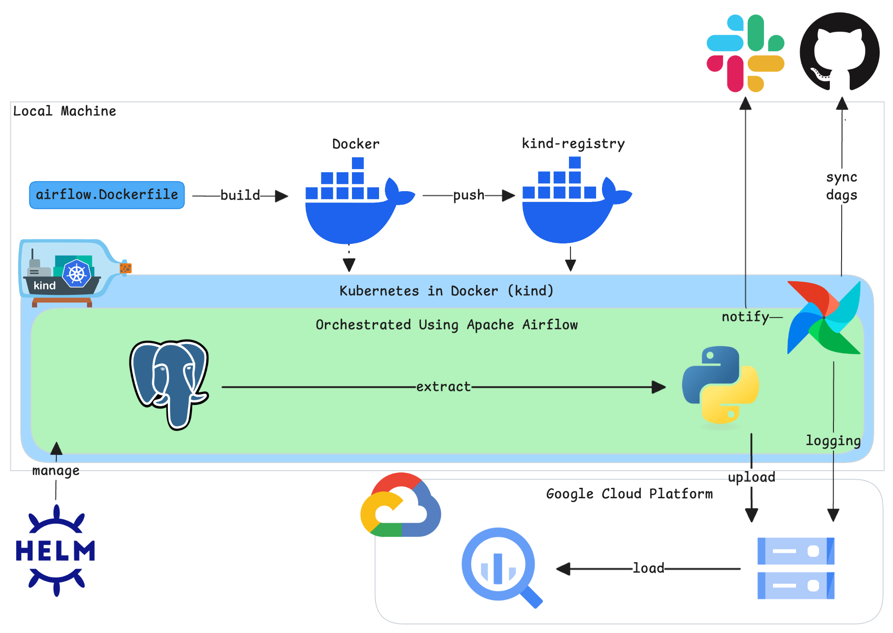
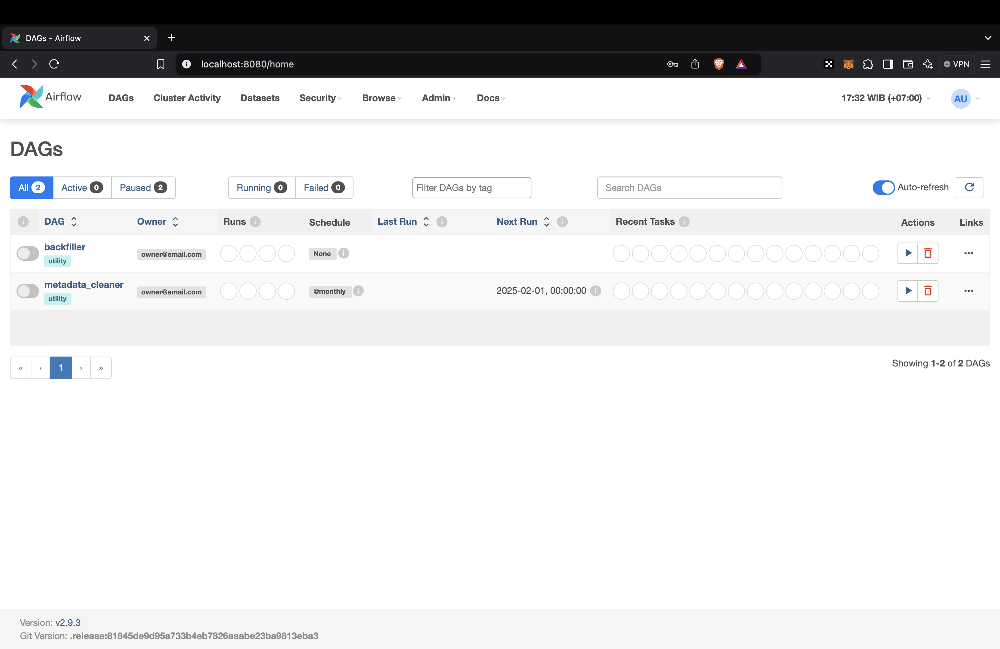
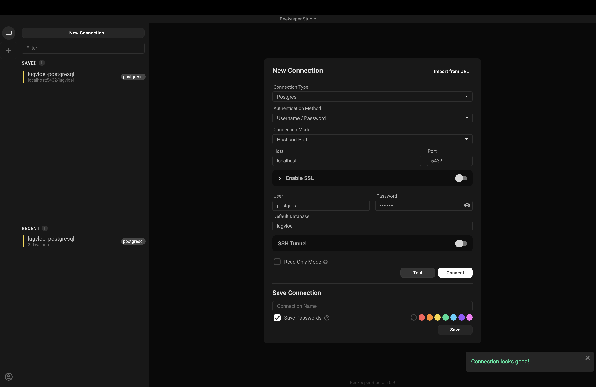
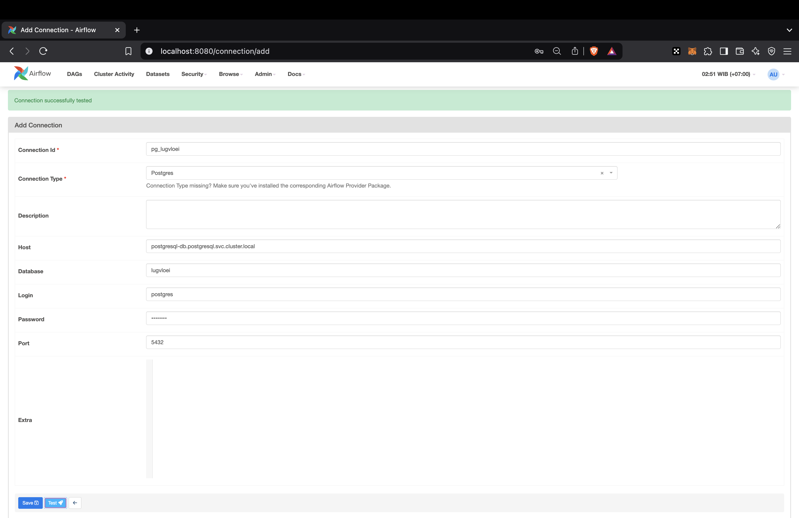
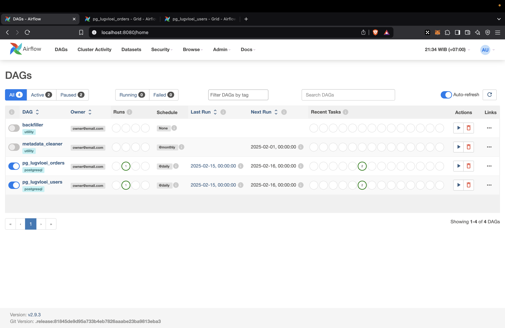

# Lugvloei

## Background
Lugvloei is Afrikaans which Airflow, I randomly chose Afrikaans, the purpose only to make the repository name unique.

## High-Level Architecture


## Setup & Installation
### Disclaimer
:warning: I tested this setup guide only on macOS Sequoia 15.0.1. If you are using a different OS, you might need to adjust several things.

### Prerequisites
- Docker (v27.4.0)
- Helm (v3.17.0)
- Personal Google Cloud Platform (GCP) project
- kind (v0.26.0)
- kubectl (v1.32.1)
- GNU Make (v3.81)
- Python (v3.11)

### Steps
#### Environment Setup
1. Fork this repository, then clone the forked repository to your device and open it using your favorite IDE.
2. Create `.env` file from the [.env.template](.env.template). You can use the example value for `CLUSTER_NAME`, `AIRFLOW_FERNET_KEY`, and `AIRFLOW_WEBSERVER_SECRET_KEY`. But, if you want to have your own key, you can generate it using this [guide](https://airflow.apache.org/docs/apache-airflow/stable/security/secrets/fernet.html#generating-fernet-key) for `AIRFLOW_FERNET_KEY` and this [guide](https://airflow.apache.org/docs/helm-chart/stable/production-guide.html#webserver-secret-key) for `AIRFLOW_WEBSERVER_SECRET_KEY`.
3. Create a Google Cloud Storage (GCS) bucket, then replace the `<your-bucket-name>` placeholder in the `AIRFLOW_REMOTE_BASE_LOG_FOLDER` value in the `.env` file value to the created bucket name.
4. Create a GCP service account, that has read and write access to GCS (for remote logging), and save the service account key as `serviceaccount.json` in the `files/` directory.
5. Update the `<your-github-username>` placeholder in the `AIRFLOW_DAGS_GIT_SYNC_REPO` value in the `.env` file to your GitHub username, and make sure you don't skip **Step 1**!
6. (Optional) To make the Airflow dependencies available in your local device, execute the following scripts.
    ```sh
    # Create Python virtual environment
    python -m venv venv
    # Activate the virtual environment
    source venv/bin/activate
    # Install base Airflow 2.9.3 with Python 3.11 dependencies
    pip install "apache-airflow==2.9.3" --constraint "https://raw.githubusercontent.com/apache/airflow/constraints-2.9.3/constraints-3.11.txt"
    # Install additional dependencies
    pip install -r airflow.requirements.txt
    ```

7. (Recommended) Adjust your Docker memory limit, set the limit to 8GB to avoid failure while installing the kind cluster.
8. Fill or use the default value for `POSTGRESQL_AUTH_DATABASE`, `POSTGRESQL_AUTH_USERNAME`, and `POSTGRESQL_AUTH_PASSWORD` values in the `.env` file.
9. (Optional) Install any database manager. FYI, I'm using **Beekeeper Studio** as I write this documentation.

#### Cluster & Airflow Installation
1. Build, tag, and push Airflow image to the cluster registry.
    ```sh
    make airflow-build
    ```

2. Provision the cluster.
    ```sh
    make install
    ```
    The following is the expected result.
    ```sh
    Creating cluster "kind" ...
    ✓ Ensuring node image (kindest/node:v1.32.0) 🖼
    ✓ Preparing nodes 📦 📦 📦
    ✓ Writing configuration 📜
    ✓ Starting control-plane 🕹️
    ✓ Installing CNI 🔌
    ✓ Installing StorageClass 💾
    ✓ Joining worker nodes 🚜
    Set kubectl context to "kind-kind"
    You can now use your cluster with:

    kubectl cluster-info --context kind-kind

    Thanks for using kind! 😊
    configmap/local-registry-hosting created
    namespace/airflow created
    secret/airflow-gcp-sa create
    ```

3. Install Airflow in the cluster.
    ```sh
    make airflow-install
    ```
    Check the pods.
    ```sh
    kubectl get pods -n airflow --watch
    ```
    :hourglass_flowing_sand: Wait until the Airflow Webserver pod status changed to **Running**, then continue to the next step. The following is the expected result.
    ```sh
    NAME                                 READY   STATUS    RESTARTS   AGE
    airflow-postgresql-0                 1/1     Running   0          3m23s
    airflow-redis-0                      1/1     Running   0          3m23s
    airflow-scheduler-556555fd95-7tnnn   3/3     Running   0          3m23s
    airflow-statsd-d76fb476b-zv4ms       1/1     Running   0          3m23s
    airflow-triggerer-0                  3/3     Running   0          3m23s
    airflow-webserver-78d4758d7-jnhzl    1/1     Running   0          3m23s
    airflow-worker-0                     3/3     Running   0          3m23s
    ```

4. Port-forward the Airflow Webserver to your local so you can open the Airflow Webserver UI using your browser.
    ```sh
    make airflow-webserver-pf
    ```
    Go to http://localhost:8080/ to check Airflow Webserver UI. Try to login using **admin**:**admin** if you didn't change the default credentials.

    You should see this page after login.

    

#### PostgreSQL Installation
1. Install PostgreSQL in the cluster.
    ```sh
    make pg-install
    ```
    Check the pods.
    ```sh
    kubectl get pods -n postgresql --watch
    ```
    :hourglass_flowing_sand: Wait until the PostgreSQL pod status changed to **Running**, then continue to the next step. The following is the expected result.
    ```sh
    NAME              READY   STATUS    RESTARTS   AGE
    postgresql-db-0   1/1     Running   0          3m39s
    ```

##### Populating the PostgreSQL Database
1. Port-forward the PostgreSQL database to your local so you can open the database using your favorite database manager.
    ```sh
    make pg-pf
    ```
    The following is the expected result.
    ```sh
    kubectl port-forward svc/postgresql-db 5432:5432 --namespace postgresql
    Forwarding from 127.0.0.1:5432 -> 5432
    Forwarding from [::1]:5432 -> 5432
    ```

2. Connect to the PostgreSQL database using your preferred method. Fill in the connection details using the value you used in step 8 in [Environment Setup](#environment-setup). Then, click the **Test** button. If you are also using **Beekeeper Studio**, it will look like this.

    

    If the connection looks good, then click **Connect** button.

3. Copy and paste the query in [PostgreSQL-DDL](docs/ddl/postgresql-ddl.sql) to the query window, and run it to create two tables and populate dummy data for each table in schema **public**.

##### Connecting Airflow With PostgreSQL
1. Open Airflow Webserver UI, hover the **Admin** dropdown on the top of the UI, then click **Connections**.
2. If you are using the default values in the [.env.template](.env.template) for your `.env` values, just add connection details below, otherwise, adjust the connection details to your `.env` values.
    ```sh
    Connection Id: pg_lugvloei
    Connection Type: Postgres
    # The format for the host is <svc>.<namespace>.svc.cluster.local
    # To get the svc name, you can run `kubectl get svc -n postgresql`
    # You actually got the details previously when you run `make pg-install`
    Host: postgresql-db.postgresql.svc.cluster.local
    Database: lugvloei
    Login: postgres
    Password: postgres
    Port: 5432
    ```

3. Click the **Test :rocket:** button. You should see a green light above the connection details with the **Connection successfully tested** text.

    

##### Creating [PostgreSQL -> GCS -> BigQuery] DAGs
1. Create a GCS bucket, then create a `GCS_DATA_LAKE_BUCKET` variable in Airflow, and use the name of the bucket you created as the value of the variable.
2. Create a `google_cloud_default` connection in Airflow, only fill in the **Project Id** and **Keyfile Path**, then create a GCP_CONN_ID variable, and set google_cloud_default as the value of the variable. If you didn't change the default values related to the service account in the [provision.sh](k8s/provision.sh) or [airflow.yaml](helm/values/airflow.yaml), you can use `/var/secrets/airflow-gcp-sa/serviceaccount.json` to fill the **Keyfile Path** value.
3. Create a new dataset in BigQuery and name it `lugvloei`. Choose the region that is the same as the bucket you created previously.
4. Enable the `pg_lugvloei_orders` and `pg_lugvloei_users` DAGs in the Airflow Webserver UI.

    

    You can check the logs and other details by clicking the DAG name.

5. Check the result in your GCS bucket and BigQuery dataset.

Akh, there you go!
