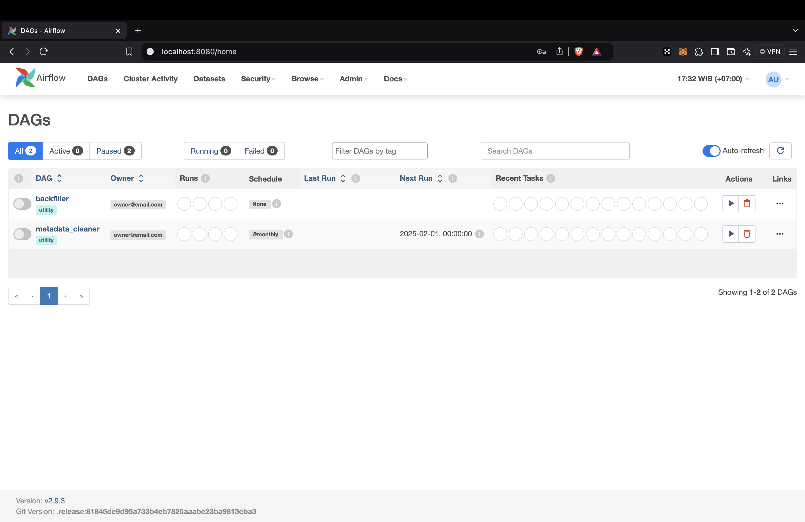

# Lugvloei

## Background
Lugvloei is Afrikaans which Airflow, I randomly chose Afrikaans, the purpose only to make the repository name unique.

## Setup
### Disclaimer
:warning: I tested this setup guide only on macOS Sequoia 15.0.1. If you are using a different OS, you might need to adjust several things.

### Prerequisites
- Docker (v27.4.0)
- Personal Google Cloud Platform (GCP) project
- kind (v0.26.0)
- kubectl (v1.32.1)
- GNU Make (v3.81)
- Python (v3.11)

### Steps
#### Environment Setup
1. Fork this repository, then clone the forked repository to your device and open it using your favorite IDE.
2. Create `.env` file from the `.env.template`. You can use the example value for `CLUSTER_NAME`, `FERNET_KEY`, and `WEBSERVER_SECRET_KEY`. But, if you want to have your own key, you can generate it using this [guide](https://airflow.apache.org/docs/apache-airflow/stable/security/secrets/fernet.html#generating-fernet-key) for `FERNET_KEY` and this [guide](https://airflow.apache.org/docs/helm-chart/stable/production-guide.html#webserver-secret-key) for `WEBSERVER_SECRET_KEY`.
3. Create a Google Cloud Storage (GCS) bucket, then replace the `<your-bucket-name>` placeholder in the `REMOTE_BASE_LOG_FOLDER` value in `.env` file value to the created bucket name.
4. Create a GCP service account, that has read and write access to GCS (for remote logging), and save the service account key as `serviceaccount.json` in the `files/` directory.
5. Update the `<your-github-username>` placeholder in the `REPO` value in `.env` file to your GitHub username, and make sure you don't skip **Step 1**!
6. (Optional) To make the Airflow dependencies available in your local device, execute the following scripts.
    ```sh
    # Create Python virtual environment
    python -m venv venv
    # Activate the virtual environment
    source venv/bin/activate
    # Install base Airflow 2.9.3 with Python 3.11 dependencies
    pip install "apache-airflow==2.9.3" --constraint "https://raw.githubusercontent.com/apache/airflow/constraints-2.9.3/constraints-3.11.txt"
    # Install additional dependencies
    pip install -r airflow.requirements.txt
    ```
7. (Recommended) Adjust your Docker memory limit, set the limit to 8GB to avoid failure while installing the kind cluster.

#### Cluster & Airflow Installation
1. Build, tag, and push Airflow image to the cluster registry.
    ```sh
    make build-airflow-image
    make tag-airlfow-image
    make push-airflow-image
    ```

2. Provision the cluster.
    ```sh
    make provision-kind-cluster
    ```
    The following is the expected result.
    ```sh
    Creating cluster "kind" ...
    ✓ Ensuring node image (kindest/node:v1.32.0) 🖼
    ✓ Preparing nodes 📦 📦 📦
    ✓ Writing configuration 📜
    ✓ Starting control-plane 🕹️
    ✓ Installing CNI 🔌
    ✓ Installing StorageClass 💾
    ✓ Joining worker nodes 🚜
    Set kubectl context to "kind-kind"
    You can now use your cluster with:

    kubectl cluster-info --context kind-kind

    Thanks for using kind! 😊
    configmap/local-registry-hosting created
    namespace/airflow created
    secret/airflow-gcp-sa create
    ```

3. Add Airflow helm repository.
    ```sh
    make add-airflow-repo
    ```

4. Install Airflow in the cluster.
    ```sh
    make install-airflow
    ```
    Check the pods.
    ```sh
    kubectl get pods -n airflow --watch
    ```
    :hourglass_flowing_sand: Wait until the Airflow Webserver pod status changed to **Running**, then continue to the next step. The following is the expected result.
    ```sh
    NAME                                 READY   STATUS    RESTARTS   AGE
    airflow-postgresql-0                 1/1     Running   0          3m23s
    airflow-redis-0                      1/1     Running   0          3m23s
    airflow-scheduler-556555fd95-7tnnn   3/3     Running   0          3m23s
    airflow-statsd-d76fb476b-zv4ms       1/1     Running   0          3m23s
    airflow-triggerer-0                  3/3     Running   0          3m23s
    airflow-webserver-78d4758d7-jnhzl    1/1     Running   0          3m23s
    airflow-worker-0                     3/3     Running   0          3m23s
    ```

5. Forward the Airflow Webserver port to your local so you can open the Airflow Webserver in your browser.
    ```sh
    make pf-airflow-webserver
    ```
    Go to http://localhost:8080/ to check Airflow Webserver. Try to login using **admin**:**admin** if you didn't change the default credentials.

    You should see this page after login.

    

#### PostgreSQL Installation
1. Add Bitnami helm repository.
    ```sh
    make add-bitnami-repo
    ```

2. Install postgresql in the cluster.
    ```sh
    make install-postgresql-db
    ```
    Check the pods.
    ```sh
    kubectl get pods -n postgresql --watch
    ```
    :hourglass_flowing_sand: Wait until the postgresql pod status changed to **Running**, then continue to the next step. The following is the expected result.
    ```sh
    NAME         READY   STATUS    RESTARTS   AGE
    postgresql-db-0   1/1     Running   0          3m39s
    ```

3. Forward the postgresql database port to your local so you can open the database using your favorite database manager.
    ```sh
    make pf-postgresql-db
    ```
    The following is the expected result.
    ```sh
    kubectl port-forward svc/postgresql-db 5432:5432 --namespace postgresql
    Forwarding from 127.0.0.1:5432 -> 5432
    Forwarding from [::1]:5432 -> 5432
    ```
