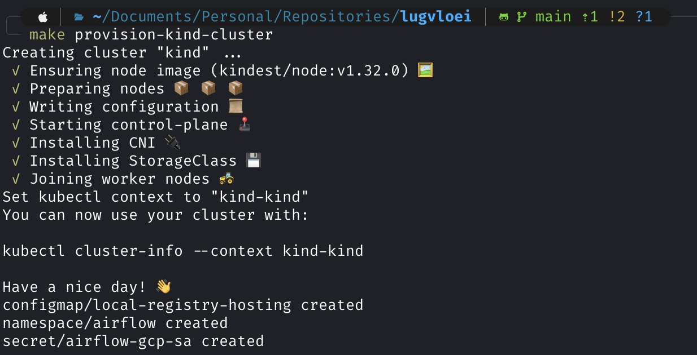
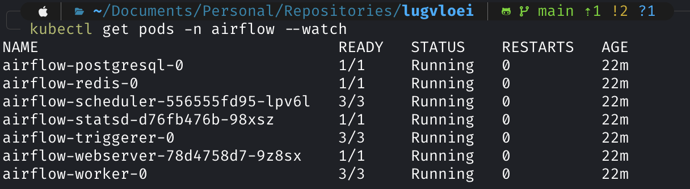

# Lugvloei

## Background
Lugvloei is Afrikaans which Airflow, I randomly chose Afrikaans, the purpose only to make the repository name unique.

## Setup
### Disclaimer
:warning: I tested this setup guide only on macOS Sequoia 15.0.1. If you are using a different OS, you might need to adjust several things.

### Prerequisites
- Docker (v27.4.0)
- GCP (Google Cloud Platform) Project
- kind (v0.26.0)
- kubectl (v1.32.1)
- GNU Make (v3.81)
- Python (v3.11)

### Steps
#### Environment Setup
1. Fork this repository, then clone the forked repository to your device and open it using your favorite IDE.
2. Create `.env` file from the `.env.template`. You can use the example value for `CLUSTER_NAME`, `FERNET_KEY`, and `WEBSERVER_SECRET_KEY`. But, if you want to have your own key, you can generate it using this [guide](https://airflow.apache.org/docs/apache-airflow/stable/security/secrets/fernet.html#generating-fernet-key) for `FERNET_KEY` and this [guide](https://airflow.apache.org/docs/helm-chart/stable/production-guide.html#webserver-secret-key) for `WEBSERVER_SECRET_KEY`.
3. Create a GCP service account, that has read and write access to GCS (for remote logging), and save the service account key as `serviceaccount.json` in the `files/` directory.
4. Create a GCS (Google Cloud Storage) bucket, then replace the `<your-bucket-name>` placeholder in the `REMOTE_BASE_LOG_FOLDER` value to the created bucket name.
5. Update the `<your-github-username>` placeholder in the `REPO` value to your GitHub username, and make sure you don't skip **Step 1**!
6. To make the Airflow dependencies available in your local device, follow below steps:
    ```sh
    python -m venv venv

    source venv/bin/activate

    pip install "apache-airflow==2.9.3" --constraint "https://raw.githubusercontent.com/apache/airflow/constraints-2.9.3/constraints-3.11.txt"

    pip install -r requirements.txt
    ```
7. Adjust your Docker memory limit, set the limit to (recommended) 8GB to avoid failure while installing the kind cluster.

#### Cluster & Airflow Installation
1. Build, tag, and push Airflow image to the cluster registry.
    ```sh
    make build-airflow-image
    make tag-airlfow-image
    make push-airflow-image
    ```
2. Provision the cluster.
    ```sh
    make provision-kind-cluster
    ```
    Check below image to see the expected result.
    
3. Add Airflow helm repositories.
    ```sh
    make add-airflow-repo
    ```
4. Install Airflow in the cluster.
    ```sh
    make install-airflow
    ```
    Check the pods
    ```sh
    kubectl get pods -n airflow --watch
    ```
    
    :hourglass_flowing_sand: Wait until the Airflow Webserver pod status changed to **Running**, then continue to the next step.
5. Forward the Airflow Webserver port to your local so you can open the Airflow Webserver in your browser.
    ```sh
    make pf-airflow-webserver
    ```
    Go to http://localhost:8080/ to check Airflow Webserver. Try to login using **admin**:**admin** if you didn't change the default credentials.

    You should see this page after login.
    
